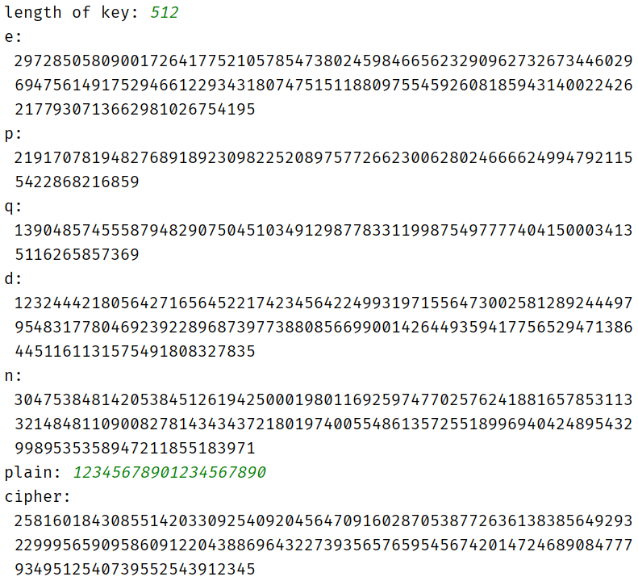
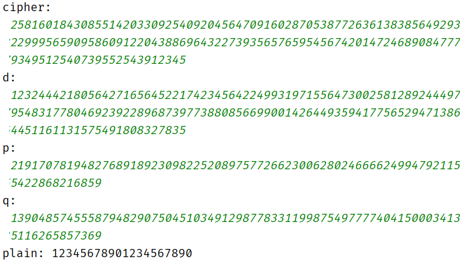
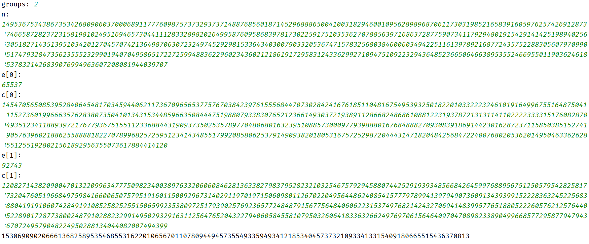
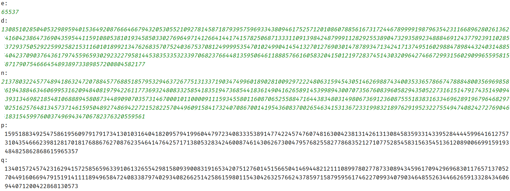

包括RSA，RSA的共模攻击，已知e，d和N，分解N。

## 实验报告

### <font size=3>【实验目的】</font>

1.   掌握 RSA 算法原理及实现；
2.    了解常见的 RSA 攻击方法。

### <font size=3>【原理简介】</font>

RSA 算法是 1977 年由 Ron Rivest、Adi Shamir 和 Leonard Adleman 共同提出的一种公钥密码体制。它的安全性基于大素数分解难问题，能够同时用于加密和数字签名，在各领域被广泛使用。RSA 是现代密码学中最为重要的密码算法之一。

### <font size=3>【实验环境】</font>

Windows 10，IntelliJ IDEA Community Edition 2020.1.1，JDK 13.0.2。

### <font size=3>【实验内容】</font>

#### 一、RSA算法

##### 1. 算法原理

RSA算法的安全性基于RSA问题的困难性，也就是基于大整数因子分解的困难性上。但是RSA问题不会比因子分解问题更加困难，也就是说，在没有解决因子分解问题的情况下可能解决RSA问题，因此RSA算法并不是完全基于大整数因子分解的困难性上的。

##### 2. 算法流程

密钥产生流程如下：

```flow
st=>start: 开始
op1=>operation: 选择素数p，q
op2=>operation: 计算n=p*q，φ(n)=(p-1)(q-1)
op3=>operation: 选择e，使得gcd(φ(n),e)=1，1<e<φ(n)
op4=>operation: 计算d=e^(-1) (mod φ(n))
out=>inputoutput: 公钥(e,n)
私钥(d,n)
st->op1->op2->op3->op4->out
```

伪代码如下：

```c
generateKey(length):
p = getPrime(length/2);//产生素数用到了MillerRabin检测
q = getPrime(length-length/2);
faiN = (p-1)(q-1);
e = random(2,faiN-1);
while(gcd(faiN,e)!=1)
    e = random(2,faiN-1);
d = ex_gcd(e,faiN)[1];
return e,d,p,q,n
```

加密算法只需计算$C = M^e\mod n$。

伪代码如下：

```c
encrypt(m,e,n):
return m^e%n;
```

常规解密算法为$M=C^d\mod n$。利用CRT可以加速解密，需要参数p，q。流程如下：

```flow
st=>start: 开始
op1=>operation: 计算m1=c^d%p，m2=c^d%q
op2=>operation: 计算p^(-1) (mod q)，q^(-1) (mod p)
out=>inputoutput: m=(m1*q*q^(-1) + m2*p*p^(-1))%pq
st->op1->op2->out
```

伪代码如下：

```c
decrypt(c,d,p,q):
m1 = c^d%p;
m2 = c^d%q;
invP = p^(-1) (mod q);
invQ = q^(-1) (mod p);
return (m1*q*invQ + m2*p*invP)%pq
```

解密算法还可以利用MMRC算法优化，MMRC算法是对CRT的优化，伪代码如下：

```c
decrypt(c,d,p,q):
m1 = c^d%p;
m2 = c^d%q;
invP = p^(-1) (mod q);
t = invP * (m2-m1)%q;
return m1+t*p;
```

##### 3. 测试样例及运行结果

512位密钥加密：



对上述结果解密：



##### 4. 总结

RSA是一种原理简单，但是效率不高的算法。主要是因为涉及到大数的计算，所以效率较低，需要通过CRT来加速。值得注意的一点是，原始的RSA算法中解密仅需d和n，而使用CRT的算法中还需要提供p和q。此外，MMRC是对CRT的优化，据说效率为原始算法的四倍。

#### 二、RSA共模攻击

##### 1. 算法原理

如果在RSA的使用中使用了相同的模n对相同的明文m进行了加密，那么就可以在不分解n的情况下还原出明文m的值 。

$c1≡m^{e_1}\mod n$，$c2≡m^{e_2}\mod n$。

首先两个加密指数互质，则存在$s_1$和$s_2$，使得：$s_1e_1+s_2e_2=1$。

所以$c_1^{s_1}c_2^{s_2}≡m^{e_1s_1}m^{e_2s_2}≡m\pmod n$。

##### 2. 算法流程

流程如下：

```flow
st=>start: 开始
op1=>operation: 找到s1，s2，s1*e1+s2*e2j=1
op2=>operation: 计算m=(ci^s1 * cj^s2)%n
out=>inputoutput: 返回m
st->op1->op2->out
```

伪代码如下：

```c
attack(e,c,n):
for i = 0 to e.length-1
    for j = i+1 to e.length
        if(gcd(e1,e2)==1)
            s[] = ex_gcd(e[i],e[j])
            rerurn (c[i]^s[1] * c[j]^s[2])%n
```

##### 3.测试样例及运行结果



##### 4. 总结

共模攻击原理也比较简单，但是要注意e互素时才能使用，所以要加入互素的判断，以及多组数据的选择，选出互素的两组进行计算。

#### 三、 已知e, d, n，分解n

##### 1. 算法原理

本算法原理参考自[RSA: how to factorize N given d](https://www.di-mgt.com.au/rsa_factorize_n.html)，对此算法进行了部分改动。

Initially we compute $k = de-1$. We then choose a random integer $g$ in the range $1 \lt g \lt N$. Now $k$ is an even number, where $k = 2^tr$ with $r$ odd and $t\geq1$, so we can compute $x = g^{k/2}, g^{k/4}, \ldots, g^{k/2^t} \pmod N$ until $x \gt 1$ and $y = \gcd(x-1, N) \gt 1$. If so, then one of our factors, say $p$, is equal to $y$, and the other is $q=N/y$ and we are done. If we don't find a solution, then we choose another random $g$.

##### 2. 算法流程

算法流程如下：

```flow
st=>start: 开始
op1=>operation: 初始化k=de-1
op2=>operation: 选择随机数g，1<g<n
op3=>operation: 计算t，k=2^t * r，r为奇数
op4=>operation: 依次计算x = g^(k/2), g^(k/4),……,g^(k/2^t) mod n
直到x>1且y=gcd(x−1,n)>1
out=>inputoutput: p=y，q=n/p
st->op1->op2->op3->op4->out
```

伪代码如下：

```c
attack(e,d,n):
k = d*e-1;
while(true)
    g = random(2,n-1);
	t = 0;
	k1 = k;
	while(k1%2=0)
        k1>>=1;
		x = g^k1%n;
		p = gcd(x-1,n);
		if(x>1 && p>1)
            q = n/p;
			return p,q;
```

这里对原算法进行了改动，原算法先求出 $k = 2^tr$的t和r，然后依次计算$x = g^{k/2}, g^{k/4}, \ldots, g^{k/2^t} \pmod N$。这里k每除以2，就计算一次，可以提高一部分效率。但是由于t不大，所以减少的运算次数很少。

##### 3. 测试样例及运行结果



##### 4. 总结

本算法主要的难度是很难想到比较有效的算法，经过查找资料才找到这个算法。找到算法之后就比较简单了。

#### 四、收获与建议

这次实验都是关于RSA的，经过实验可以看出，RSA的计算都是大数的运算，效率较低。而且对RSA的攻击没有高效的算法，这也是我们选择RSA的原因。由于Java的BigInteger类中没有提供开方的方法，所以对大数开方比较困难，小指数广播攻击也就没有实现。

关于在实际应用中提高安全性的措施，主要有以下几点：

1. 增加密钥长度。对于RSA来说，密钥越长，攻击的代价就会增加很多。
2. 选择合适的参数。有些参数可能会导致攻击比较容易，应当尽量构造安全性高的参数。
3. 使用不同的参数加密，如果使用相同的参数，就可能会遭到共模攻击这样的攻击。
4. 对消息进行处理，使用其他方法对消息进行混淆和扩散，降低通过消息内容进行攻击的可能性。